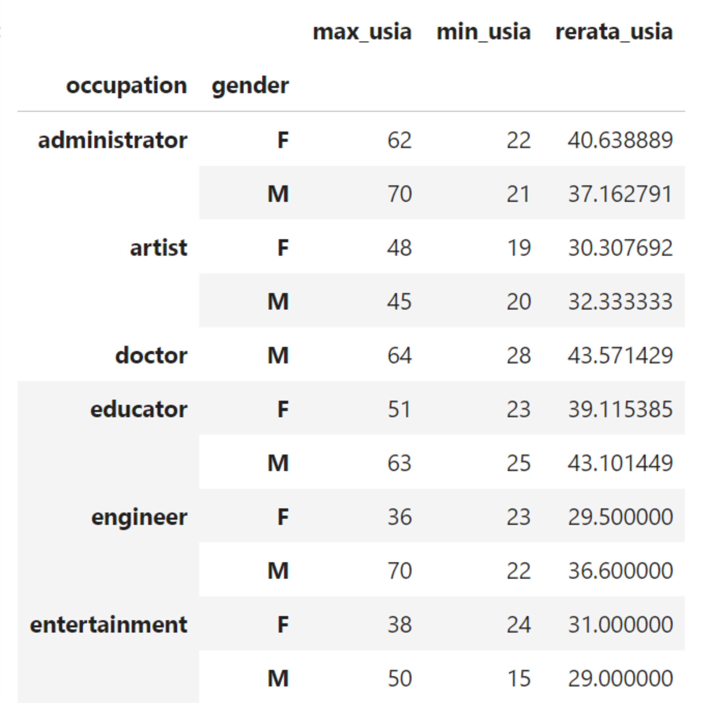
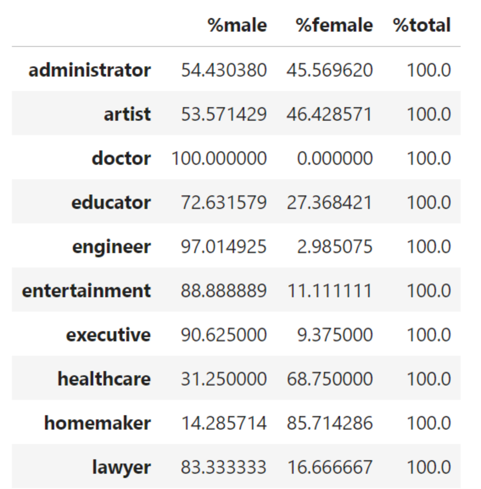
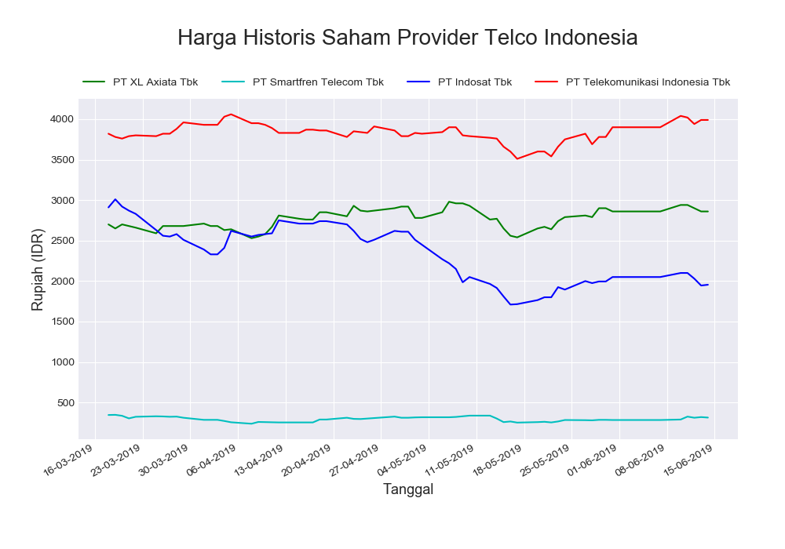

# Data-Analytics-Visualization-Exercise


[](https://postimg.cc/s1XMHB3T)


<hr>


#

### **Soal 1 - Profesi**

Disediakan sebuah dataset yang berisi daftar profesi beberapa responder, unduh: [profesi.csv](https://github.com/Lecturer-Jcds/Data-Analytics-Visualization-Exercise/blob/master/profesi.csv). Buatlah sebuah file python (__.py__) atau notebook (__.ipynb__) yang dapat menyelesaikan perintah berikut.

1. __Ada berapa jenis profesi yang ada dalam dataset tersebut? Sebutkan!__
    
    Output yang diharapkan:
    
    ```bash
    21

    ['technician', 'other', 'writer', 'executive', 'administrator', 'student', 'lawyer', 'educator', 'scientist', 'entertainment', 'programmer', 'librarian', 'homemaker', 'artist', 'engineer', 'marketing', 'none', 'healthcare', 'retired', 'salesman', 'doctor']
    ```

2. __Buatlah sebuah dataframe yang menunjukkan data usia maksimal, minimal & rata-ratanya, kemudian dikelompokkan berdasarkan profesi & gender!__

    Output yang diharapkan:

    

3. __Buatlah sebuah dataframe yang menunjukkan persentase pria & wanita tiap profesi!__

    Output yang diharapkan:

    


<hr>


#

### **Soal 2 - Harga Historis Saham Provider Telco Indonesia**

Disediakan 4 buah file __.csv__ yang berisi harga historis saham harian selama 3 bulan terakhir (18/Mar/2019 - 14/Jun/2019) dari 4 perusahaan provider telekomunikasi ternama di Indonesia. Unduh file .csv dari repo ini:

Nama Provider|Unduh csv
-----|-----
PT. XL Axiata Tbk|[EXCL.JK.csv](./EXCL.JK.csv)
PT Smartfren Telecom Tbk|[FREN.JK.csv](./FREN.JK.csv)
PT Indosat Tbk|[ISAT.JK.csv](./ISAT.JK.csv)
PT Telekomunikasi Indonesia Tbk|[TLKM.JK.csv](./TLKM.JK.csv)

#

1. Buatlah sebuah file __python__ maupun __jupyter notebook .ipynb__ yang mengakses data dari ke-4 file .csv tersebut, kemudian tampilkan data plot harga penutupan (close) harian seluruh data yang ada. Output yang diharapkan berupa __grafik garis__ yang menampilkan harga penutupan (close) harian dari ke-4 perusahaan telco selama 3 bulan terakhir:

    

#

2. Tampilkan data plot harga penutupan (close) harian selama __bulan April 2019__. Output yang diharapkan berupa __grafik garis__ yang menampilkan harga penutupan (close) harian dari ke-4 perusahaan telco selama __bulan April 2019__:

    
    
    

 <hr>

#

## **Soal 3 - World Happiness**

Disediakan dataset laporan tingkat kebahagiaan di berbagai negara di dunia, unduh di repo ini atau klik : [World Happiness](./2019.csv) lalu buatlah sebuah file _notebook_ (__.ipynb__) dan lakukan __Exploratory Data Analysis__ terhadap Dataset tersebut.


<hr>


_Lampirkan file jawaban via email ke khumaeni@purwadhika.com_
